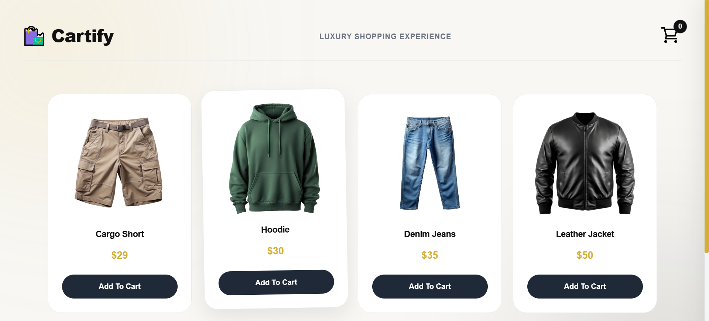
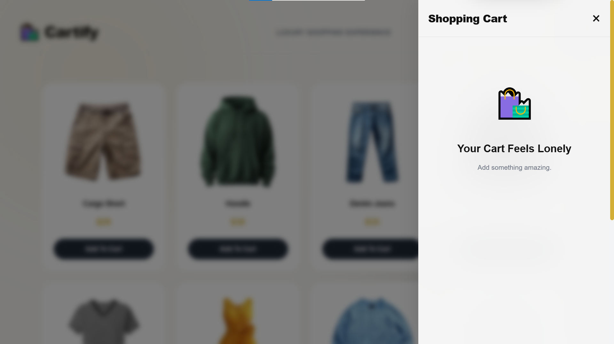
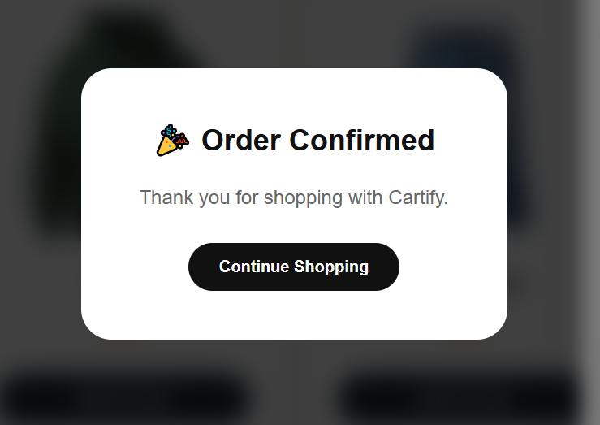

# 🛍️ Luxury Shopping Cart

A modern and elegant Shopping Cart application built with **HTML, CSS, and Vanilla JavaScript**. Designed with a premium aesthetic, smooth animations, and a fully interactive cart experience.

---

## ✨ Features

* 🛒 Add Products to Cart
* ➕ Increase Product Quantity
* ➖ Decrease Product Quantity
* ❌ Remove Products
* 💾 Persistent Cart using LocalStorage
* 🔔 Animated Toast Notifications
* 🔊 Add & Remove Sound Effects
* 🏷️ Dynamic Cart Badge
* 📦 Empty Cart State
* 🪟 Glassmorphism Cart Sidebar
* ⏳ Luxury Loader Screen
* 💳 Checkout Modal
* 🌟 Smooth Hover Effects
* 📱 Fully Responsive Design

---

## 🛠️ Technologies Used

* HTML5
* CSS3
* Vanilla JavaScript
* LocalStorage API

---

## 📸 Screenshots

### Home Page



### Cart Sidebar



### Checkout Modal



---

## 🚀 Getting Started

Clone the repository

```bash
git clone https://github.com/Azeem-Toretto-1/luxury-shopping-cart.git
```

Navigate to the project folder

```bash
cd luxury-shopping-cart
```

Open `index.html` in your browser.

---

## 📚 What I Learned

During this project, I improved my understanding of:

* DOM Manipulation
* Event Delegation
* LocalStorage Management
* Dynamic Rendering
* UI State Handling
* CSS Animations
* Responsive Layouts
* Component-Based Thinking in Vanilla JavaScript

---

## 🎯 Future Improvements

* Search Products
* Product Categories Filter
* Dark Mode
* Coupon System
* Real Payment Integration
* Backend Support

---

## 👨‍💻 Author

**Azeem Malik**

Frontend Developer | Learning JavaScript & Building Modern Web Experiences

---

⭐ If you like this project, consider giving it a star.
